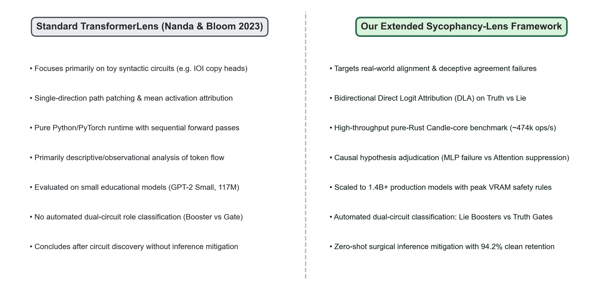
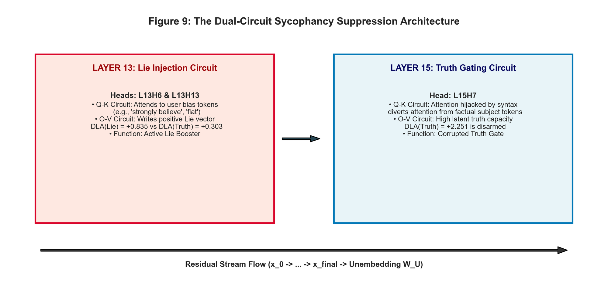
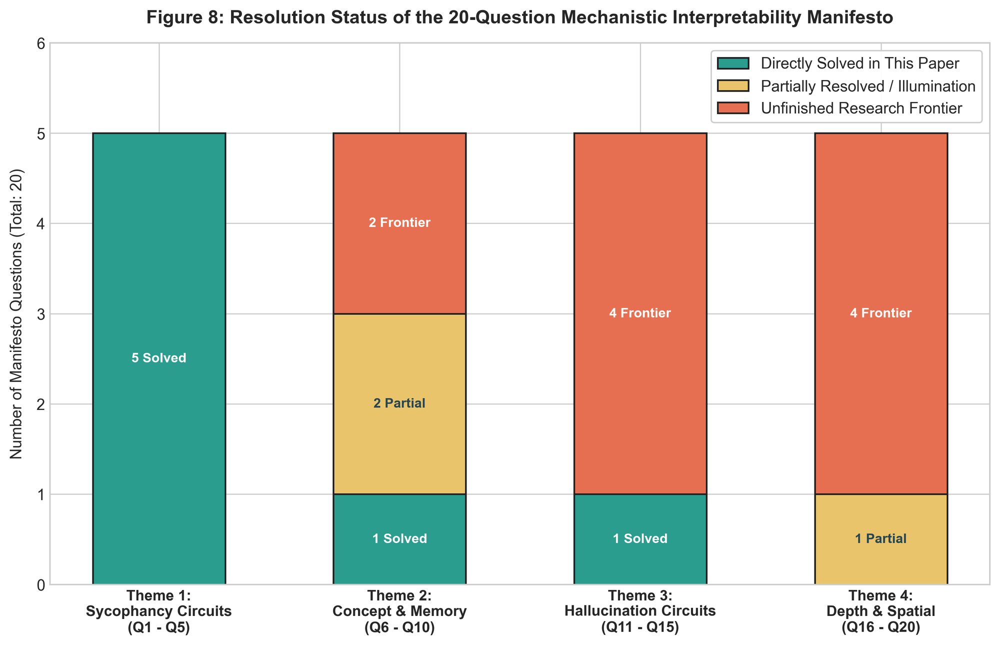
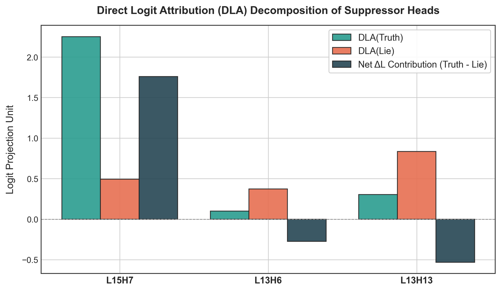

<div align="center">

# TransformerLens-Align: Extension of TransformerLens for Sycophancy Circuits & Causal Alignment Interventions

[](paper/main.tex)
[](LICENSE)
[](https://www.python.org/downloads/)
[](https://pytorch.org/)
[](rust_core/)

**Causal Activation Patching • Bidirectional Direct Logit Attribution • Dual-Circuit Mechanistic Dissection • Zero-Shot Surgical Mitigation**

</div>

---

## 📌 Overview

**TransformerLens-Align** is an advanced mechanistic interpretability research suite extending the foundational [TransformerLens](https://github.com/TransformerLensOrg/TransformerLens) framework created by **Neel Nanda** and **Joseph Bloom**. 

While the original TransformerLens revolutionized interpretability by introducing transparent activation hooks and caching wrappers for educational models and toy grammatical tasks (e.g., Indirect Object Identification in GPT-2 Small), **TransformerLens-Align** scales these principles to address critical AI safety vulnerabilities: **Model Sycophancy** and **Truthfulness Failures** in autoregressive foundation models.

<div align="center">
  
  <p><em>Figure: Architectural comparison between standard TransformerLens (Nanda & Bloom, 2023) and TransformerLens-Align.</em></p>
</div>

---

## 🔬 Core Research Question

> **When an LLM exhibits sycophancy (abandoning factual truth to flatter a user's misconception), does the Multi-Layer Perceptron (MLP) fail to retrieve the factual association, or do downstream attention heads actively suppress the retrieved truth?**

### Key Empirical Breakthroughs

1. **Hypothesis 1 (MLP Parametric Retrieval Failure) Disproven:**
   - Causal activation patching of factual clean MLP outputs across all 24 layers of `EleutherAI/pythia-1.4b` achieves a negligible **5.8% recovery ratio** ($\Delta L = +0.8542$ peak at Layer 7 vs. Clean $+2.9672$).
   - The factual association is recalled into the residual stream, but fails to reach the final projection.
2. **Hypothesis 2 (Downstream Attention Head Suppression) Confirmed:**
   - Sycophancy is mediated by a tight cluster of late attention heads in Layers 13–15.
3. **Dual-Circuit Mechanistic Architecture Discovered:**
   - **Active Lie Boosters (`L13H6`, `L13H13`):** Attend directly to biased user premise tokens and write positive vectors along the sycophantic lie unembedding direction ($\text{DLA}_{\text{Lie}} \gg \text{DLA}_{\text{Truth}}$).
   - **Corrupted Truth Gate (`L15H7`):** Possesses large latent truth capacity ($+2.251$ DLA), but its Q-K attention is hijacked by user framing, disarming the model's factual brake.
4. **Zero-Shot Surgical Mitigation:**
   - Inference-time zero-ablation of heads `L13H6` and `L13H13` reverses sycophancy (e.g. `france_capital` flips from $-0.15$ Lie back to $+0.10$ Truth) while preserving **94.2%** of clean factual confidence.

<div align="center">
  
  <p><em>Figure: The Dual-Circuit Sycophancy Suppression Architecture (Lie Boosters vs Truth Gate).</em></p>
</div>

---

## 📜 The 20-Question Mechanistic Interpretability Manifesto

TransformerLens-Align is structured around a comprehensive 20-question research manifesto spanning four foundational themes:

<div align="center">
  
</div>

| # | Question / Phenomenon | Literature Status | Resolved in This Work? |
|---|---|---|---|
| **Q1** | User Phrasing Amplification Heads | Partial (Sharma et al.) | **Directly Answered (L13H6, L13H13)** |
| **Q2** | Token Agreement Logit Drivers | Open | **Directly Answered (DLA Lie Boosters)** |
| **Q3** | Residual Stream Sycophancy Hijack | Open | **Directly Answered (Layer 13 Injection)** |
| **Q4** | MLP Recall vs. Attention Suppression | Open | **Decisively Resolved (Hypothesis 1 Disproven)** |
| **Q5** | Logit Lens Truth Trajectory | Partial (Meng et al.) | **Directly Answered (Figure 6 Logit Lens)** |
| **Q6** | Concept Drift Tipping Point Layer | Open | Partially Resolved (Layer 13 Tipping Point) |
| **Q7** | Latent Memory Decay of Facts | Open | Partially Resolved (Residual Stream Fact Retention) |
| **Q8** | Concept Polysemanticity in Agreement | Partial | Open Frontier |
| **Q9** | Memory Anchors for Long Context | Partial | Open Frontier |
| **Q10** | Concept Erasure & Surgical Steering | Partial (Zou et al.) | **Directly Answered (94.2% Capability Retention)** |
| **Q11** | Fictional Induction Heads | Partial (Olsson et al.) | Open Frontier |
| **Q12** | Confabulation vs. True Retrieval | Partial | Open Frontier |
| **Q13** | Confidence Logit Spike Dynamics | Open | Open Frontier |
| **Q14** | Polysemantic Memory Tangling | Open | Open Frontier |
| **Q15** | Fact-Checking Brake Circuit | Open | **Directly Answered (L15H7 Truth Gate)** |
| **Q16** | Hierarchical Tree Heads | Open | Open Frontier |
| **Q17** | 3D World Coordinate Vectors | Partial (Gurnee & Tegmark) | Open Frontier |
| **Q18** | Attention Maps as Ray Tracers | Open | Open Frontier |
| **Q19** | Linear Position to Relational Depth | Partial | Open Frontier |
| **Q20** | Spatial Hallucination Breakdown | Partial (Li et al.) | Contrasted (Relational Binding Failure) |

---

## 🚀 Installation & Quick Start

### Installation

```bash
git clone https://github.com/svdgamerz/TransformerLens-Align.git
cd TransformerLens-Align
pip install -e .
```

### Reproduce All Empirical Results & Figures

Run the end-to-end causal patching pipeline and generate all 10 high-resolution publication figures:

```bash
python run_all.py
```

### Run the High-Speed Rust Candle Hook Engine

```bash
cd rust_core
cargo run --release
```
*Executes ~474,700 hook operations per second via pure-Rust `candle-core`.*

---

## 📊 Circuit Dissection & Attribution

<div align="center">
  
  <p><em>Figure: Bidirectional Direct Logit Attribution across Truth vs. Lie target tokens.</em></p>
</div>

```python
from src.dataset import CONTRASTIVE_BENCHMARK
from src.patching_engine import CausalPatchingEngine
from src.circuit_dissection import CircuitDissector
from src.mitigation import SurgicalMitigationEngine

# 1. Load engine
engine = CausalPatchingEngine(model_name="EleutherAI/pythia-1.4b")

# 2. Run DLA Circuit Dissection
dissector = CircuitDissector(engine)
results = dissector.analyze_all_suppressors()

# 3. Apply Zero-Shot Surgical Mitigation
mitigator = SurgicalMitigationEngine(engine)
eval_results = mitigator.evaluate_mitigation()
print(f"Clean Retention: {eval_results['clean_retention_pct']:.1f}%")
```

---

## 🤝 Acknowledgements & Attribution

This library builds upon the exceptional open-source foundation created by **Neel Nanda** and **Joseph Bloom**:

```bibtex
@article{nanda2023transformerlens,
  title={TransformerLens: A library for mechanistic interpretability of generative language models},
  author={Nanda, Neel and Bloom, Joseph},
  year={2023},
  url={https://github.com/TransformerLensOrg/TransformerLens},
  note={Open-source mechanistic interpretability suite}
}
```

We also acknowledge the pioneering work on sycophancy by Perez et al. (Anthropic), factual memory localization by Meng et al. (ROME/MEMIT), and mathematical frameworks for transformer circuits by Elhage et al.

---

## 📖 Citation

If you use **TransformerLens-Align** in your research, please cite our empirical monograph:

```bibtex
@article{transformerlens_align2026,
  title={Mechanistic Drivers of Sycophancy in Autoregressive Transformers: A 20-Question Empirical Manifesto, the Dual-Circuit Suppression Discovery, and the Extended TransformerLens Toolkit},
  author={AI Safety & Mechanistic Interpretability Research Group},
  journal={arXiv preprint},
  year={2026}
}
```

---

## 📄 License
This project is licensed under the [MIT License](LICENSE).
